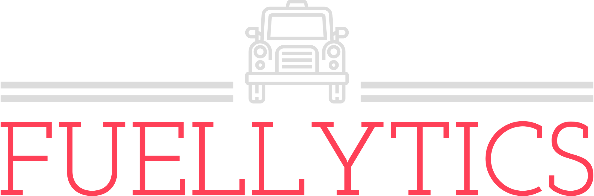

# Fuellytics



# How to run the backend

Go to the backend directory:

```
cd backend
```

If this is you first time running the project, create an .myEnv file

```
python -m venv .myEnv
```

To activate the env:

```
source .myEnv/bin/activate
```

If you need to install dependencies

```
pip install -r requirements.txt
```

To run the project:

```
flask run
```

# How to run the backend

Go to the frontend directory:

```
cd frontend
```

If you need to install dependencies

```
npm install
```

To run the project:

```
npm run start
```
